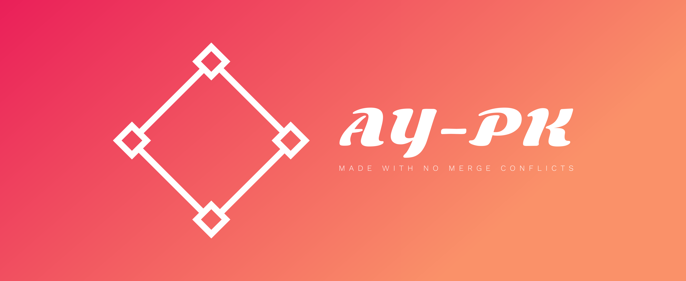

<h1 align="center">  IO/DB Project @ Sparta</h1>

  
Menu

  <h5>
    <a href="#project requirements">Project requirements</a> •
  </h5>
  <h5>
    <a href="#checklist">Checklist requirements implemented</a> •
  </h5>
  <h5>
  	<a href="#screencast">Screencasts of the app running</a> •  
  </h5>
	<h5>
  	<a href="#credits and contact">Credits</a> •  
  </h5>
  <h5>
  	<a href="#license">License</a>   
  </h5>

---

### Project requirements

TO FILL IN

----

### Checklist

- [x] Req 1
- [ ] Req 2
- [ ] Req 3
- [ ] Req 4
- [ ] Req 5

----

### Screencast

TO FILL IN

---

### Credits and contact

[Kamil](https://github.com/rwenmax)

[Pruthvi](https://github.com/pruthvi-lalji)

[Yefri](https://github.com/grimz5129)

[Alex](https://github.com/alexsusanu)

----

### License

**Free** *'cause why not*

